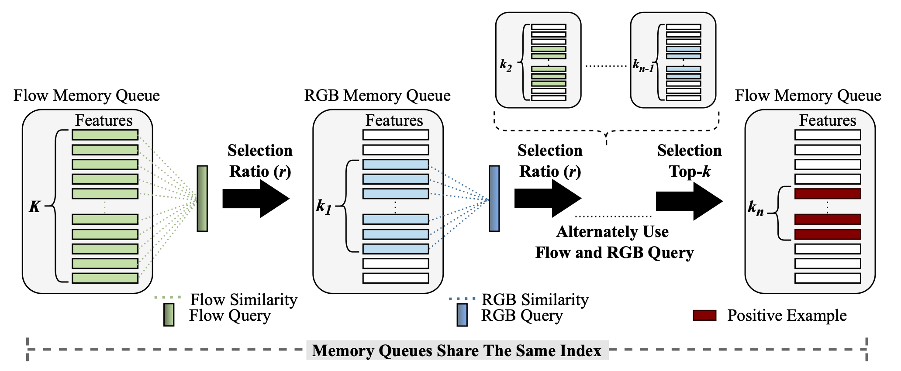

# CPR

Official repository for《Self-supervised Video Representation Learning with Cascade Positive Retrieval》
[[arXiv]](https://arxiv.org/abs/2201.07989)



``` 
@article{wu2022-cpr,
  title={Self-supervised Video Representation Learning with Cascade Positive Retrieval},
  author={Wu, Cheng-En and Lai, Farley and Hu, Yu Hen and Kadav, Asim},
  journal={arXiv preprint arXiv:2201.07989},
  year={2022}
}
```
## Installation
```
conda env create -f environment.yml
```

## Dataset

### For UCF101:

 Download both RGB and TVL1 optical flow LMDB files in CoCLR's [repo](https://github.com/feichtenhofer/twostreamfusion) and extract them to `data` folder.
 Then, rewrite your root path of these files in `dataset/lmdb_dataset.py`.

Following directory structure:
```
--data
----UCF101
------ucf101_frame.lmdb
------...
------...
------ucf101_tvl1_frame.lmdb
------...
------...
```

### For Other Datasets:

Follow this
[repo](https://github.com/TengdaHan/MemDPC/tree/master/process_data) to extract RGB and optical flow frames.
Next, run `process_data/src/convert_video_to_lmdb.py` to creat LMDB files.

## Pretrained Weights
Both pretrained InfoNCE RGB and Flow models on UCF101 are provided by [CoCLR](https://github.com/TengdaHan/CoCLR/blob/main/README.md#pretrained-weights).

## Training with CPR
### CPR Specific Settings
* `--cascade`: enable CPR.
* `--stage 7`: number of stages for CPR.
* `--ratio 0.5`: selection ratio at each stage.
### CoCLR+CPR on UCF101 for One Cycle
For RGB Model:
```
CUDA_VISIBLE_DEVICES=0,1 python -m torch.distributed.launch \
--nproc_per_node=2 main_coclr.py --net s3d --topk 5 --moco-k 2048 \
--dataset ucf101-2stream-2clip --seq_len 32 --ds 1 --batch_size 16 \
--epochs 100 --schedule 80 --name_prefix Cycle1-FlowMining_Cascade_flow_debug -j 8 \
--pretrain {rgb_infoNCE_checkpoint.pth.tar} {flow_infoNCE_checkpoint.pth.tar} \
--cascade --stage 7 --ratio 0.5
```

For Flow Model:
```
CUDA_VISIBLE_DEVICES=0,1 python -m torch.distributed.launch \
--nproc_per_node=2 main_coclr.py --net s3d --topk 5 --moco-k 2048 --reverse \
--dataset ucf101-2stream-2clip --seq_len 32 --ds 1 --batch_size 16 \
--epochs 100 --schedule 80 --name_prefix Cycle1-RGBMining_Cascade_Sg_5_Rt_0.50_ -j 8 \
--pretrain {flow_infoNCE_checkpoint.pth.tar} {rgb_cycle1_checkpoint.pth.tar} \
--cascade --stage 7 --ratio 0.50
```

### CoCLR+CPR on k400 for One Cycle

For RGB Model:
```
CUDA_VISIBLE_DEVICES=0,1 python -m torch.distributed.launch \
--nproc_per_node=2 main_coclr.py --net s3d --topk 5 --moco-k 16384 \
--dataset k400-2stream-2clip --seq_len 32 --ds 1 --batch_size 16 \
--epochs 50 --schedule 40 --name_prefix Cycle1-FlowMining_Cascade_Sg_7_Rt_0.50_ -j 8 \
--pretrain {rgb_infoNCE_checkpoint.pth.tar} {flow_infoNCE_checkpoint.pth.tar} \
--cascade --stage 7 --ratio 0.5

```

For Flow Model:
```
CUDA_VISIBLE_DEVICES=0,1 python -m torch.distributed.launch \
--nproc_per_node=2 main_coclr.py --net s3d --topk 5 --moco-k 16384 --reverse \
--dataset k400-2stream-2clip --seq_len 32 --ds 1 --batch_size 16 \
--epochs 50 --schedule 40 --name_prefix Cycle1-RGBMining_Cascade_7_Rt_0.50_ -j 8 \
--pretrain {flow_infoNCE_checkpoint.pth.tar} {rgb_cycle1_checkpoint.pth.tar} \
--cascade --stage 7 --ratio 0.5
```

## Evaluate on Downstream Tasks
### Settings
* `--dataset ucf101`: run RGB (ucf101) or Flow (ucf101-f) input.
* `--ten_crop`: test with 10-crop that gives better performace than center-crop.

### Retrieve video clips on UCF101 (RGB)
`cd eval/`

```
CUDA_VISIBLE_DEVICES=0,1 python main_classifier.py --net s3d --dataset ucf101 \
--seq_len 32 --ds 1 --batch_size 32 --train_what ft --epochs 500 --schedule 400 450 \
--test {selected_rgb_finetuned_checkpoint.pth.tar} --ten_crop
```

### Finetune model for action recognition on UCF101 (RGB)
`cd eval/`

```
CUDA_VISIBLE_DEVICES=0 python main_classifier.py --net s3d --dataset ucf101 \
--seq_len 32 --ds 1 --test {selected_rgb_pretrained_checkpoint.pth.tar} --retrieval
```

## Training with UberNCE

```
CUDA_VISIBLE_DEVICES=0,1 python -m torch.distributed.launch \
--nproc_per_node=2 main_nce.py --net s3d --model ubernce --moco-k 2048 \
--dataset ucf101-2clip --seq_len 32 --ds 1 --batch_size 16 \
--epochs 300 --schedule 240 -j 8 --name_prefix scratch_
```


## Acknowledgements
Our implementation is adapted from [CoCLR](https://github.com/BestJuly/IIC). We thank the authors for the contribution.
